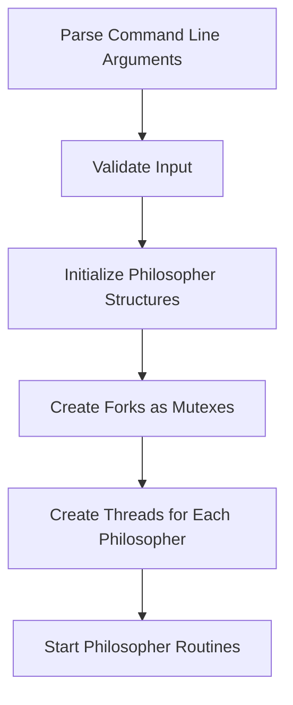
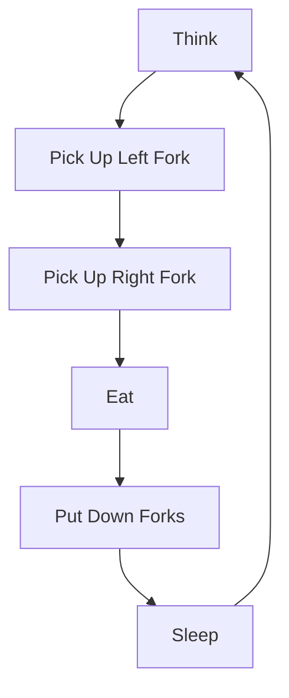

# Dining Philosophers Problem

A C implementation of the classic **Dining Philosophers Problem** using pthreads, demonstrating concurrent programming concepts and synchronization mechanisms.

## 🍽️ What is the Dining Philosophers Problem?

The Dining Philosophers Problem is a classic computer science problem that illustrates challenges in resource allocation and deadlock prevention in concurrent systems.

### The Scenario

Imagine a round table with **N philosophers** sitting around it. Between each pair of philosophers, there is exactly **one fork**. Philosophers alternate between **thinking** and **eating**. To eat, a philosopher needs **two forks** (the one to their left and the one to their right).

```
        Philosopher 1
           /    \
    Fork 1        Fork 2
   /                  \
Philosopher 5    Philosopher 2
   \                  /
    Fork 5        Fork 3
           \    /
        Philosopher 4
           /    \
    Fork 4        Fork 4
           \    /
        Philosopher 3
```

### The Challenge

The problem arises when all philosophers try to eat simultaneously:
1. Each philosopher picks up their left fork
2. Each philosopher waits for their right fork (which is held by their neighbor)
3. **Deadlock occurs** - no philosopher can eat, and they all starve

## 🏗️ Project Structure

```
philosophers/
├── philo/
│   ├── includes/
│   │   └── philo.h          # Header file with all declarations
│   ├── srcs/
│   │   ├── main.c           # Main program entry point
│   │   ├── init.c           # Initialization functions
│   │   ├── parsing.c        # Input validation
│   │   ├── philo_routine.c  # Philosopher behavior logic
│   │   ├── philo_routine_breaker.c  # Death checking
│   │   ├── write_msg.c      # Message output functions
│   │   ├── custom_usleep.c  # Precise timing functions
│   │   ├── utils_functions.c # Utility functions
│   │   └── ft_putnbr.c      # Number printing function
│   └── Makefile             # Build configuration
└── README.md                # This file
```

## 🚀 How to Build and Run

### Prerequisites
- GCC compiler
- Make utility
- Linux/Unix system (for pthreads support)

### Building the Project
```bash
cd philo
make
```

### Running the Program
```bash
./philo [number_of_philosophers] [time_to_die] [time_to_eat] [time_to_sleep] [number_of_times_each_philosopher_must_eat]
```

### Example Usage
```bash
# 5 philosophers, die after 800ms without eating, take 200ms to eat, sleep for 200ms
./philo 5 800 200 200

# Same as above, but each philosopher must eat exactly 7 times
./philo 5 800 200 200 7
```

## 📊 Program Parameters

| Parameter | Description | Example |
|-----------|-------------|---------|
| `number_of_philosophers` | Number of philosophers (and forks) | `5` |
| `time_to_die` | Time in milliseconds before a philosopher dies of starvation | `800` |
| `time_to_eat` | Time in milliseconds it takes for a philosopher to eat | `200` |
| `time_to_sleep` | Time in milliseconds a philosopher spends sleeping | `200` |
| `number_of_times_each_philosopher_must_eat` | Optional: Program stops when all philosophers eat this many times | `7` |

## 🔧 How It Works

### 1. Initialization Phase


### 2. Philosopher Life Cycle


### 3. Fork Management Strategy

To prevent deadlock, the program uses a **memory address-based ordering** strategy:

```c
// Philosophers always pick up forks in the same order
// (lower memory address first)
if (philo->left_fork < philo->right_fork)
{
    pthread_mutex_lock(philo->left_fork);
    pthread_mutex_lock(philo->right_fork);
}
else
{
    pthread_mutex_lock(philo->right_fork);
    pthread_mutex_lock(philo->left_fork);
}
```

This ensures that if two philosophers want the same fork, they will always try to acquire it in the same order, preventing circular wait conditions.

## 🛡️ Synchronization Mechanisms

### Mutexes (Mutual Exclusion)
- **Fork Mutexes**: Each fork is protected by a mutex
- **Print Mutex**: Ensures output messages don't get mixed up
- **Death Mutex**: Protects the global death flag

### Death Monitoring
A "big brother" structure monitors all philosophers:
```c
typedef struct big_brother_is_watching_u
{
    pthread_mutex_t dead_mutex;
    long            dead_flag;
} t_big;
```

When any philosopher dies, the flag is set to 1, and all threads terminate gracefully.

## 📝 Output Format

The program outputs timestamped messages showing each philosopher's actions:

```
[timestamp] [philosopher_id] has taken a fork
[timestamp] [philosopher_id] is eating
[timestamp] [philosopher_id] is sleeping
[timestamp] [philosopher_id] is thinking
[timestamp] [philosopher_id] died
```

### Example Output
```
0 1 has taken a fork
0 1 has taken a fork
0 1 is eating
200 1 is sleeping
200 2 has taken a fork
200 2 has taken a fork
200 2 is eating
400 1 is thinking
400 2 is sleeping
```

## 🎯 Key Features

### ✅ Deadlock Prevention
- Memory address-based fork ordering
- Strict synchronization protocols

### ✅ Starvation Prevention
- Fair fork allocation through mutex ordering
- Optional meal counting to ensure all philosophers eat

### ✅ Precise Timing
- Microsecond-precise sleep function
- Accurate timestamp calculations

### ✅ Graceful Termination
- Proper cleanup of all resources
- Thread-safe death detection

## 🧪 Testing Scenarios

### Test 1: Basic Functionality
```bash
./philo 5 800 200 200
```
**Expected**: All philosophers should eat, sleep, and think without dying.

### Test 2: Death Scenario
```bash
./philo 4 410 200 200
```
**Expected**: One philosopher should die due to starvation.

### Test 3: Single Philosopher
```bash
./philo 1 800 200 200
```
**Expected**: Philosopher takes one fork and dies (can't eat with only one fork).

### Test 4: Meal Limit
```bash
./philo 5 800 200 200 7
```
**Expected**: Program stops when all philosophers eat exactly 7 times.

## 🔍 Code Architecture Highlights

### Main Data Structures

```c
typedef struct philo
{
    long            thread_id;        // Philosopher ID
    long            nb_philo;         // Total number of philosophers
    long            time_to_die;      // Time before death
    long            time_to_eat;      // Time to eat
    long            time_to_sleep;    // Time to sleep
    long            nb_must_eat;      // Required meals (optional)
    pthread_mutex_t *left_fork;       // Left fork mutex
    pthread_mutex_t *right_fork;      // Right fork mutex
    pthread_mutex_t print_mutex;      // Output synchronization
    t_big           *watcher;         // Death monitoring
} t_philo;
```

### Thread Safety Features
- **Atomic Operations**: All shared data access is protected
- **Mutex Ordering**: Prevents deadlock through consistent lock ordering
- **Condition Checking**: Regular death checks during operations

## 🚨 Common Issues and Solutions

### Issue: Mixed Output Messages
**Solution**: All output is protected by a print mutex to ensure clean, ordered output.

### Issue: Timing Inaccuracy
**Solution**: Custom `precise_usleep` function provides microsecond-level timing precision.

### Issue: Resource Leaks
**Solution**: Comprehensive cleanup in main function destroys all mutexes and frees memory.

## 📚 Learning Objectives

This project demonstrates:
- **Concurrent Programming**: Multiple threads working simultaneously
- **Synchronization**: Using mutexes to protect shared resources
- **Deadlock Prevention**: Strategies to avoid system deadlocks
- **Resource Management**: Proper allocation and cleanup of system resources
- **Error Handling**: Robust input validation and error checking

## 🤝 Contributing

Feel free to submit issues, feature requests, or pull requests to improve this implementation.

---

*"The unexamined life is not worth living." - Socrates*

*"The unexamined code is not worth running." - Programmers*